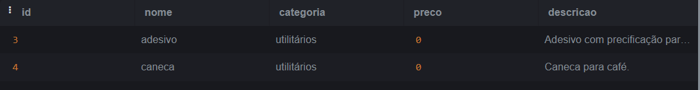

05/14/2024

# Day 7: MasterClass

- SQL
- Practical SQL Exercise

# SQL

SQL (Structured Query Language) is a programming language used to manage and manipulate relational databases, maintaining the structure and also being able to include, delete, modify and search information from the tables of these databases.

Subsets of the SQL Language:

<figure>    </figure>

## Main SQL Commands:

1. **CREATE DATABASE** : Creates a new database.

    ```sql
    CREATE DATABASE nome_do_banco_de_dados;
    ```

2. **CREATE TABLE** : Creates a new table within the database.

    ```sql
    CREATE TABLE nome_da_tabela (
        coluna1 tipo_de_dado,
        coluna2 tipo_de_dado,
        ...
    );
    ```

3. **INSERT INTO** : Inserts new records into an existing table.

    ```sql
    INSERT INTO nome_da_tabela (coluna1, coluna2, ...) VALUES (valor1, valor2, ...);
    ```

4. **SELECT** : Retrieves data from one or more tables.

    ```sql
    SELECT coluna1, coluna2 FROM nome_da_tabela WHERE condição;
    ```

5. **UPDATE** : Updates existing data in a table.

    ```sql
    UPDATE nome_da_tabela SET coluna1 = novo_valor WHERE condição;
    ```

6. **DELETE** : Deletes records from a table.

    ```sql
    DELETE FROM nome_da_tabela WHERE condição;
    ```

7. **ALTER TABLE** : Changes the structure of an existing table.

    ```sql
    ALTER TABLE nome_da_tabela ADD coluna tipo_de_dado;
    ```

8. **DROP TABLE** : Deletes an existing table.

    ```sql
    DROP TABLE nome_da_tabela;
    ```

9. **CREATE INDEX** : Creates an index on a column of a table to optimize searching.

    ```sql
    CREATE INDEX index_nome ON nome_da_tabela (coluna);
    ```

10. **JOIN** : Combines data from two or more tables based on a related condition.

    ```sql
    SELECT * FROM tabela1 INNER JOIN tabela2 ON tabela1.coluna = tabela2.coluna;
    ```

# Exercises: ✏️

**Exercising SQL**

Using the website https://sqliteonline.com/ as a "compiler" for the SQL queries in the **database_challenge.sql** file.

Based on the **Users** table, you should:

1. Perform a query that counts the number of records in the table.

    ```sql
    SELECT COUNT(*) FROM usuarios;
    ```

    - Response:

        

2. Perform a query to find the user with id 10.

    ```sql
    SELECT * FROM usuarios WHERE id = 10;
    ```

    - Response:

        

3. Perform a query to find the user named "Bruce Wayne".

    ```sql
    SELECT * FROM usuarios WHERE nome = 'Bruce Wayne';
    ```

    - Response:

        

4. Perform a query to find the user with the email "ghost_silva@fantasma.com".

    ```sql
    SELECT * FROM usuarios WHERE email = 'ghost_silva@fantasma.com';
    ```

    - Response:

        

5. Perform a query to delete the user with email "peterparker@marvel.com".

    ```sql
    DELETE FROM usuarios WHERE email = 'peterparker@marvel.com';
    ```

Based on the **Products** table, you should:

1. Perform a query that displays products with an empty description;

    ```sql
    SELECT * FROM produtos WHERE descricao = '';
    ```

    - Response:

        

2. Perform a query that presents products with the "games" category;

    ```sql
    SELECT * FROM produtos WHERE categoria = 'games';
    ```

    - Response:

        

3. Perform a query that displays products with a price of "0";

    ```sql
    SELECT * FROM produtos WHERE preco = 0;
    ```

    - Response:

        

4. Perform a query that displays products with a price greater than "100.00";

    ```sql
    SELECT * FROM produtos WHERE preco > 100.00;
    ```

    - Response:

        

5. Perform a query that displays products with prices between "1000.00" and "2000.00";

    ```sql
    SELECT * FROM produtos WHERE preco BETWEEN 1000.00 AND 2000.00;
    ```

    - Response:

        

6. Perform a query that displays products whose name contains the word "game";

    ```sql
    SELECT * FROM produtos WHERE nome LIKE '%jogo%';
    ```

    - Response:

        