05/15/2024

# Day 8: MasterClass

- NoSQL
- Practical NoSQL exercises

# NoSQL (Not Only SQL):

NoSQL, unlike traditional relational databases, offers more flexible data models, horizontal scalability, and different data models, such as documents, columns, key-value, and graphs.

<figure>    </figure>

Main commands in MQL (MongoDB Query Language) to interact with a MongoDB database to manipulate data effectively and efficiently:

1. **Insert Document:**

    ```
    db.colecao.insertOne({ campo1: valor1, campo2: valor2 })
    ```

2. **Consult Documents:**

    ```
    db.colecao.find({ campo: valor })
    ```

3. **Update Document:**

    ```
    db.colecao.updateOne(
      { campo: valor },
      { $set: { novoCampo: novoValor } }
    )
    ```

4. **Delete Document:**

    ```
    db.colecao.deleteOne({ campo: valor })
    ```

5. **Count Documents:**

    ```
    db.colecao.countDocuments({ campo: valor })
    ```

6. **Design Results:**

    ```
    db.colecao.find({ campo: valor }, { campo: 1, _id: 0 })
    ```

# Practical Exercise:

The website https://www.humongous.io/app/playground/mongodb/new was used as a "compiler" for the NoSQL queries, using the data collections bson_usuarios.json and bson_produtos.json .

After pasting the users Json, based on the listed users, you should:

1. Perform a query that counts the number of existing records.

    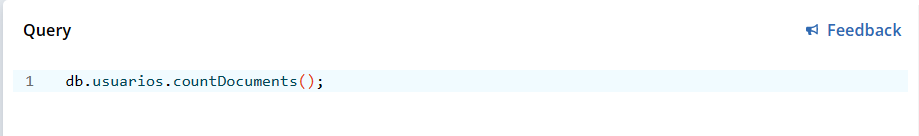

    - Result:

        

2. Perform a query to change the user named "Teste Start" to "Teste Finish".

    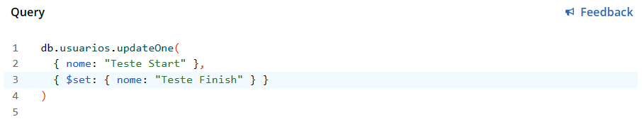

    - Result:

        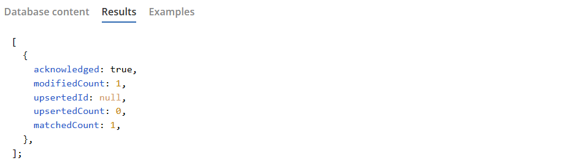

3. Perform a query to find the user named "Bruce Wayne".

    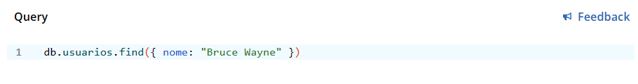

    - Result:

        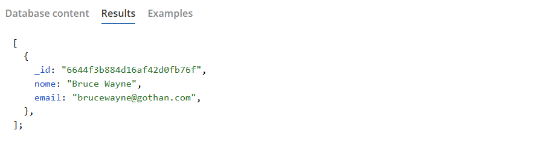

4. Perform a query to find the user with the email "ghost_silva@fantasma.com".

    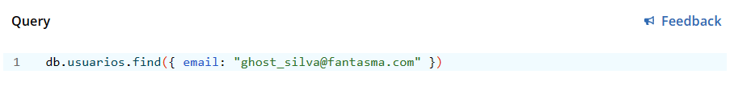

    - Result:

        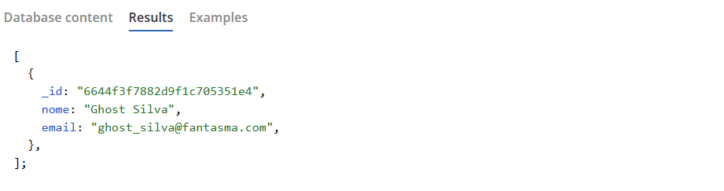

5. Perform a query to delete the user with email "peterparker@marvel.com".

    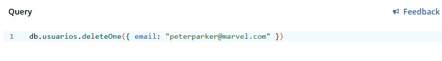

    - Result:

        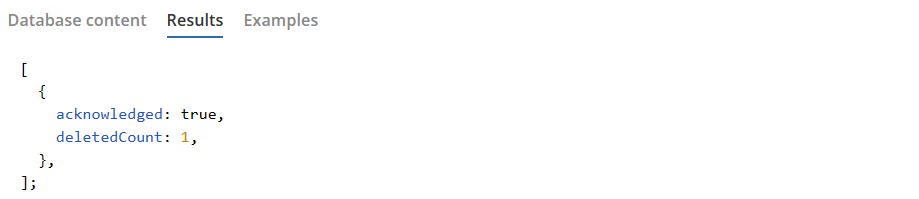

After pasting the products Json, based on the listed products, you should:

1. Perform a query that displays products with an empty description;

    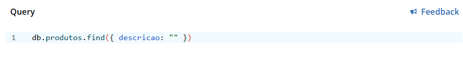

    - Result:

        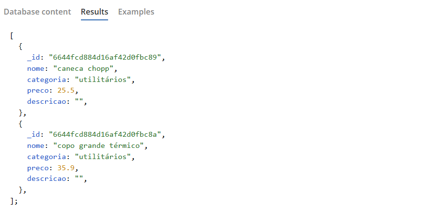

2. Perform a query that presents products with the "games" category;

    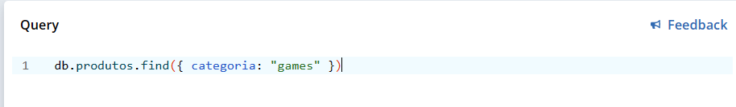

    - Result:

        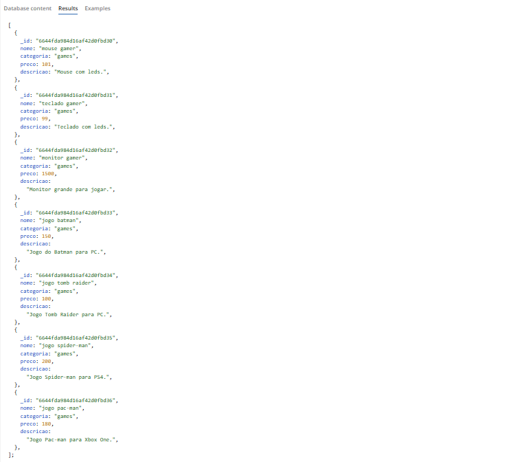

3. Perform a query that displays products with a price of "0";

    

    - Result:

        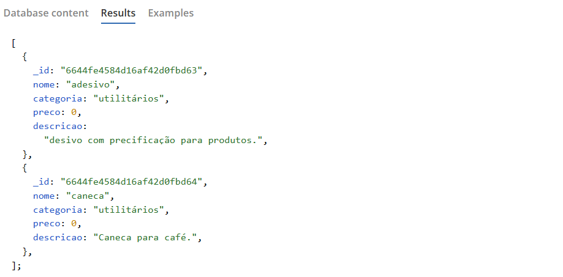

4. Perform a query that displays products with a price greater than "100.00";

    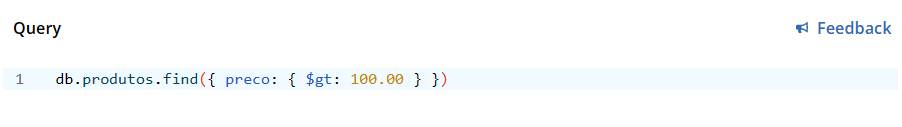

    - Result:

        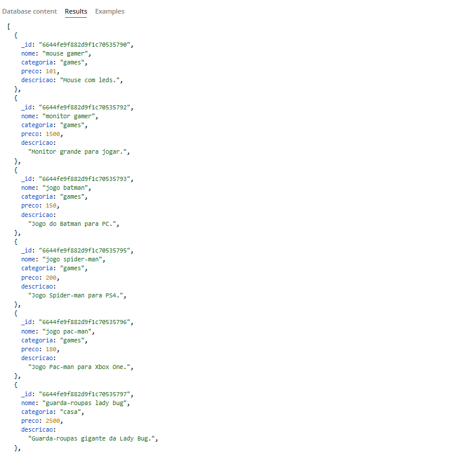

5. Perform a query that displays products with prices between "1000.00" and "2000.00";

    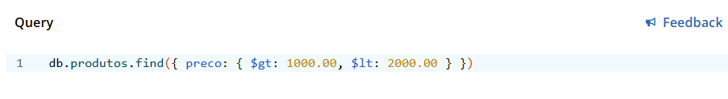

    - Result:

        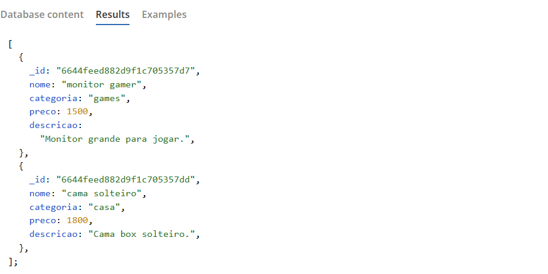

6. Perform a query that displays products whose name contains the word "game".

    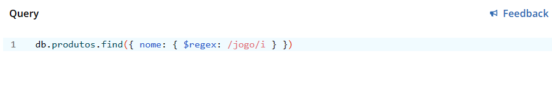

    - Result:

        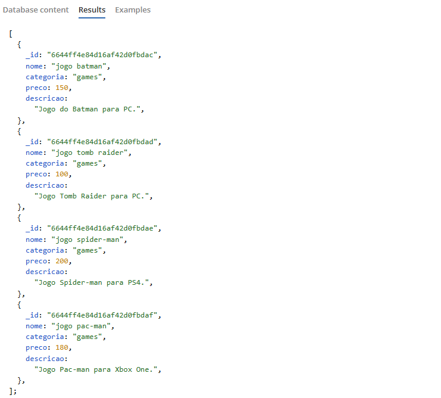