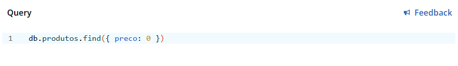

15/05/2024

# Dia 8: MasterClass

- NoSQL
- Exercícios práticos de NoSQL

# NoSQL (Not Only SQL):

NoSQL ao contrário do tradicional banco de dados relacional esse oferece modelos de dados mais flexíveis, escalabilidade horizontal e diferentes modelos de dados, como documentos, colunas, chave-valor e grafos.

<figure>
  
</figure>

Principais comandos em MQL (MongoDB Query Language) para interagir com um banco de dados MongoDB para manipular dados de forma eficaz e eficiente:

1. **Inserir Documento:**
   ```
   db.colecao.insertOne({ campo1: valor1, campo2: valor2 })
   ```

2. **Consultar Documentos:**
   ```
   db.colecao.find({ campo: valor })
   ```

3. **Atualizar Documento:**
   ```
   db.colecao.updateOne(
     { campo: valor },
     { $set: { novoCampo: novoValor } }
   )
   ```

4. **Excluir Documento:**
   ```
   db.colecao.deleteOne({ campo: valor })
   ```

5. **Contar Documentos:**
   ```
   db.colecao.countDocuments({ campo: valor })
   ```

6. **Projetar Resultados:**
   ```
   db.colecao.find({ campo: valor }, { campo: 1, _id: 0 })
   ```

# Exercício Prático:

O site https://www.humongous.io/app/playground/mongodb/new foi utilizado como "compilador" das queries NoSQL, usando as collections de dados bson_usuarios.json e bson_produtos.json .

Após colar o Json de usuários, com base nos usuários listados, você deve:

1) Realizar uma consulta que conte o número de registros existentes.

    

    - Resultado:

        
        

2) Realizar uma consulta para alterar o usuário com o nome "Teste Start" para "Teste Finish".

    

    - Resultado:

        

3) Realizar uma consulta para encontrar o usuário com o nome "Bruce Wayne".

    

    - Resultado:

        

4) Realizar uma consulta para encontrar o usuário com o e-mail "ghost_silva@fantasma.com".

    

    - Resultado:

        

5) Realizar uma consulta para deletar o usuário com e-mail "peterparker@marvel.com".

    

    - Resultado:

        


Após colar o Json de produtos, com base nos produtos listados, você deve:

1) Realizar uma consulta que apresente produtos com descrição vazia;

    

    - Resultado:

        

2) Realizar uma consulta que apresente produtos com a categoria "games";

    

    - Resultado:

        

3) Realizar uma consulta que apresente produtos com preço "0";

    

    - Resultado:

        

4) Realizar uma consulta que apresente produtos com o preço maior que "100.00";

    

    - Resultado:

        

5) Realizar uma consulta que apresente produtos com o preço entre "1000.00" e "2000.00";

    

    - Resultado:

        

6) Realizar uma consulta que apresente produtos em que o nome contenha a palavra "jogo".

    

    - Resultado:
    
        