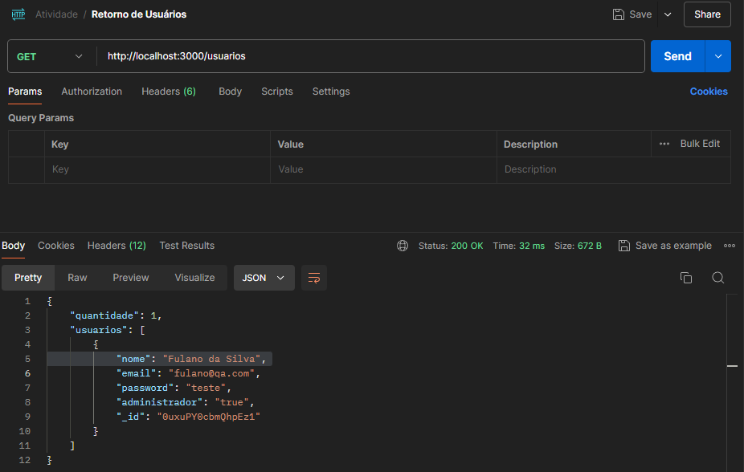
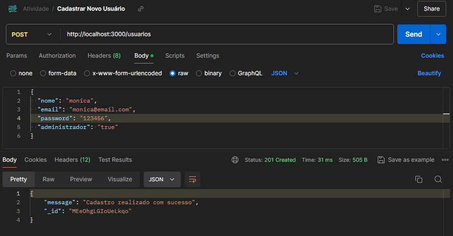
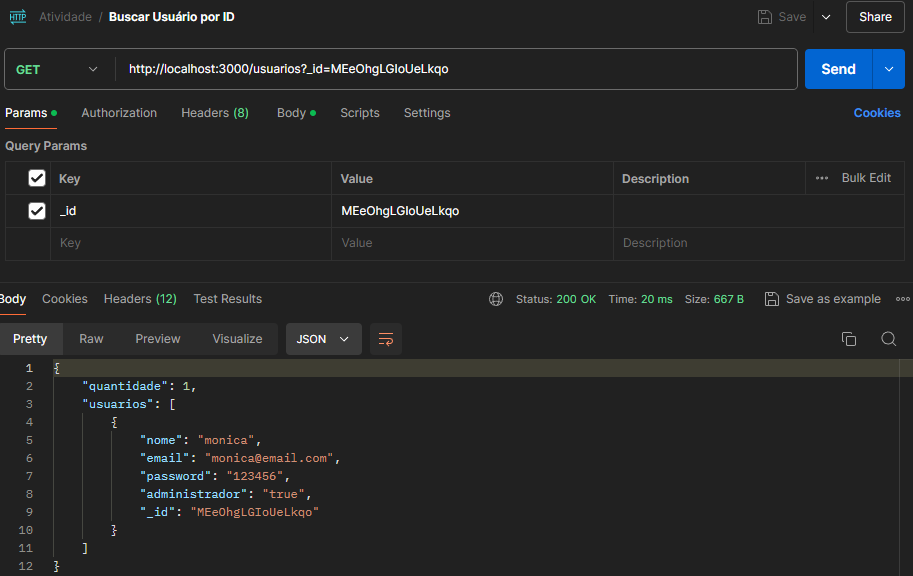
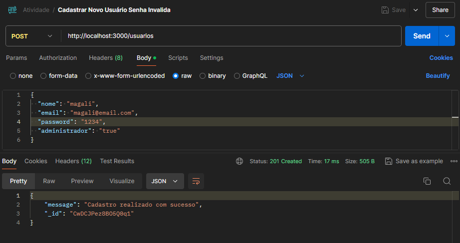
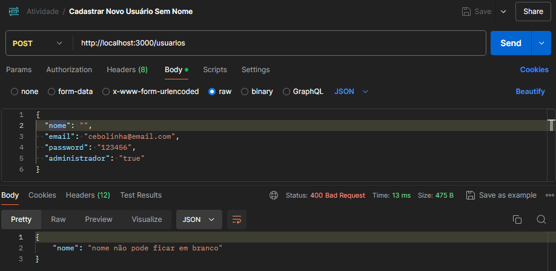
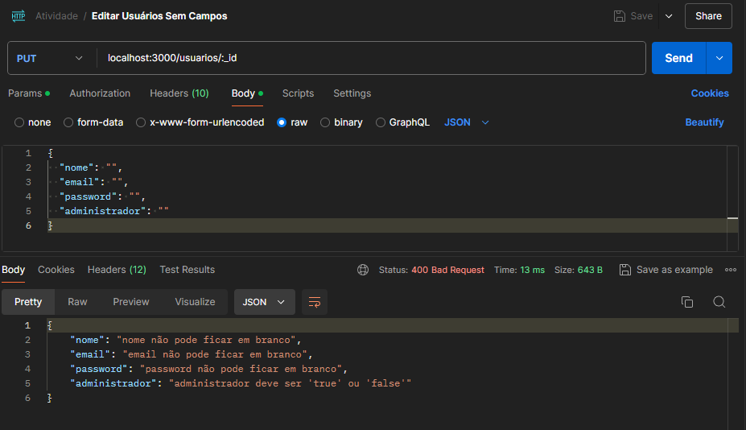
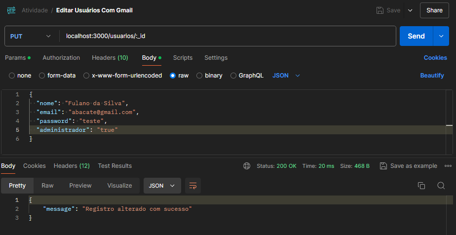
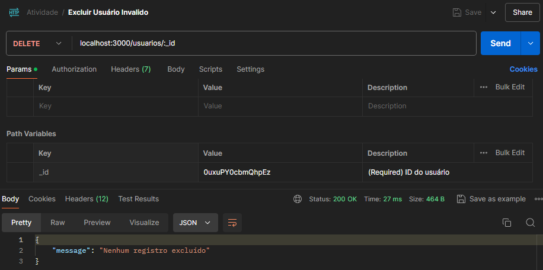
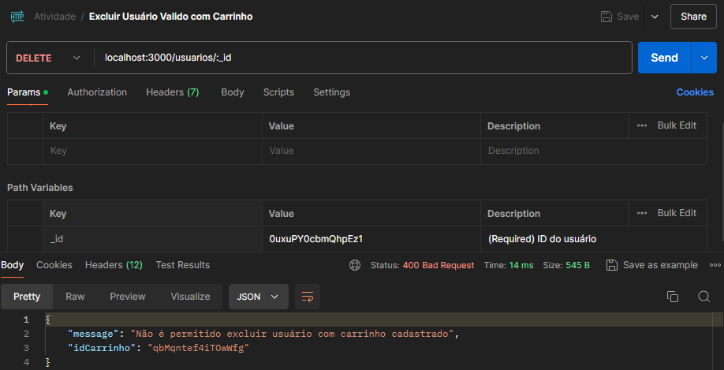

# Day 8: MasterClass

- API Testing Tools
- Udemy Course: Introduction to Postman
- Activity

## Tools for manual testing

- **Postman:** A platform for developing and testing APIs. It allows you to create requests, organize collections, automate tests, generate documentation, among other functions.
- **Insomnia:** Also focused on REST API testing. It offers features such as environment creation, automated testing and code generation for different languages.

## Tools for automated testing

- **Rest-Assured:** A powerful and flexible Java testing library. Makes it easy to create readable and concise tests, supporting different data formats and validations.
- **HTTParty:** A useful Ruby library for testing REST APIs. Offers a friendly syntax and integration with other Ruby testing tools.

## Load testing tool

- **JMeter:** An open-source tool that allows you to simulate a large number of users accessing an application, measure response times, identify bottlenecks and analyze detailed results.
- **K6:** A tool focused on JavaScript scripting and cloud execution. It is easy to use, scalable and offers real-time reporting.

## Introduction to Postman

Provides a complete environment for creating, sending, testing, and documenting HTTP requests to your APIs.

**Advantages of Postman:**

- Intuitive Interface
- Simplified Tests
- Collections and Environments
- Test Automation
- Automatic Documentation
- Integration with External Tools

**Request and Query Parameters:**

- Request Parameters: Information sent in the request body to APIs that use POST, PUT or PATCH methods.
- Query Parameters: Information added to the end of the request URL for APIs that use the GET method. They are used to filter, sort or page results.

**Variables:**

Postman allows you to create and use variables to store values that can be reused in different parts of your requests.

**Automated Tests:**

Postman lets you write test scripts to automate the verification of responses from your APIs. You can validate status codes, check response content, measure response times, and more.

## Activity

You must make your first requests using the API https://serverest.dev/ as a study base.

For this activity it is expected that you:

1. Create a Get request to validate user feedback via the API;

    ```
     Método: GET
     URL: http://localhost:3000/usuarios
     Resultado Esperado: Status HTTP 200
     Corpo da resposta: Lista de usuários
    ```

- Result Obtained:

1. Create a Post request to register a new user through the API;

    ```
     Método: POST
     URL: http://localhost:3000/usuarios
     Body:
         Nome: monica
         Email: monica@email.com
         Senha: 123456
         Administrador: true
     Resultado Esperado: Status HTTP 201
     Corpo da resposta: Cadastro com sucesso
    ```

- Result Obtained:

1. Create a Get request to validate the return of a user only through the API (you can use the IDs of the users you will create);

    ```
     Método: GET
     URL: http://localhost:3000/usuarios/{_id}
     Dados de Entrada:
         ID do usuário: MEeOhgLGIoUeLkqo
     Resultado Esperado: Status HTTP 200 (OK)
     Corpo da resposta: Dados do usuário
    ```

- Result Obtained:

1. Create alternative scenarios when registering users, explore possible errors that may occur and map requests through Postman;

    ```
     Método: POST
     URL: http://localhost:3000/usuarios
     Body:
         Nome: magali
         Email: magali@email.com
         Senha: 1234
         Administrador: true
     Resultado Esperado: Status HTTP 400
     Corpo da resposta: Senha fora dos padrões
    ```

- Result Obtained:

    ```
      Método: POST
      URL: http://localhost:3000/usuarios
      Body:
          Nome:
          Email: cebolinha@email.com
          Senha: 123456
          Administrador: true
      Resultado Esperado: Status HTTP 400
      Corpo da resposta: Nome precisa estar preenchido
    ```

- Result Obtained:

1. Create alternative scenarios when updating users, explore possible errors that may occur and map requests through Postman;

    ```
     Método: PUT
     URL: http://localhost:3000/usuarios/:_id
     ID: 0uxuPY0cbmQhpEz1
     Body:
         Nome:
         Email:
         Senha:
         Administrador:
     Resultado Esperado: Status HTTP 400
     Corpo da resposta: Campos precisam estar preenchidos.
    ```

- Result Obtained:

    ```
      Método: PUT
      URL: http://localhost:3000/usuarios/:_id
      ID: 0uxuPY0cbmQhpEz1
      Body:
          Nome: "Fulano da Silva"
          Email: "abacate@gmail.com"
          Senha: "teste"
          Administrador: "true"
      Resultado Esperado: Status HTTP 400
      Corpo da resposta: Email deve ser valido.
    ```

- Result Obtained:

1. Create alternative scenarios for deleting users, explore possible errors that may occur and map requests through Postman.

    ```
     Método: DELETE
     URL: http://localhost:3000/usuarios:_id
     ID: 0uxuPY0cbmQhpEz
     Resultado Esperado: Status HTTP 200
     Corpo da resposta: Id inválido
    ```

- Result Obtained:

    ```
      Método: DELETE
      URL: http://localhost:3000/:_id
      ID: 0uxuPY0cbmQhpEz1
      Resultado Esperado: Status HTTP 400
      Corpo da resposta: Usuário com carrinho cadastrado
    ```

Result Obtained: