# Test Case Suite

## Scenario 1: User Registration

- **CT01** : User registration successful

    - Acceptance Criteria: Registration with permitted provider email and password within the limits (5 to 10 characters).

    - Expected Result: HTTP Status 201 (Created) and user successfully registered.

    - Result Obtained:

        - Method: POST

        - URL: http://localhost:3000/users

        - Body:

            ```
              Nome: cebolinha
              Email: cebolinha@email.com
              Senha: 123456
              Administrador: true
            ```

    

- **CT02** : User registration failed

    - CT02.1:

        - Acceptance Criteria: Check whether the fields are mandatory in the registration form.

        - Expected Result: HTTP status 400 if any required field is missing.

        - Result Obtained:

            - Method: POST

            - URL: http://localhost:3000/users

            - Body:

                ```
                  Nome: “”
                  Email: “”
                  Senha: “”
                  Administrador: “”
                ```

            

    - CT02.2:

        - Acceptance Criteria: Attempt to register a user with an email address already in use.

        - Prerequisite: Email already registered.

        - Expected Result: HTTP status 400 indicating that the email is already in use.

        - Result Obtained:

            - Method: POST

            - URL: http://localhost:3000/users

            - Body:

                ```
                  Nome: monica
                  Email: cebolinha@email.com
                  Senha: 123456
                  Administrador: true
                ```

            

    - CT02.3:

        - Acceptance Criteria: Attempt to register a user with an email from a Gmail or Hotmail provider.

        - Expected Result: HTTP status 400 indicating that the email provider is not allowed.

        - Result Obtained:

            - Method: POST

            - URL: http://localhost:3000/users

            - Body:

                ```
                  Nome: monica
                  Email: monica@gmail.com
                  Senha: 123456
                  Administrador: true
                ```

            

    - CT02.4:

        - Acceptance Criteria: Attempting to register a user with an invalid email address (without @, with invalid special characters, etc.).

        - Expected Result: HTTP status 400 indicating that the email is invalid.

        - Result Obtained:

            - Method: POST

            - URL: http://localhost:3000/users

            - Body:

                ```
                  Nome: monica
                  Email: monicagmail.com
                  Senha: 123456
                  Administrador: true
                ```

            

    - CT02.5:

        - Acceptance Criteria: Attempting to register a user with a password outside the limits (less than 5 or greater than 10).

        - Expected Result: HTTP status 400 indicating that the password does not meet the length requirements.

        - Result Obtained:

            - Method: POST

            - URL: http://localhost:3000/users

            - Body:

                ```
                  Nome: monica
                  Email: turmadamonica@email.com
                  Senha: 012345678910
                  Administrador: true
                ```

            

    - CT02.6:

        - Acceptance Criteria: Attempt to register a user without a valid name.

        - Expected Result: HTTP status 400 indicating that it needs a name.

        - Result Obtained:

            - Method: POST

            - URL: http://localhost:3000/users

            - Body:

                ```
                  Nome: “ “
                  Email: turmadocascao@email.com
                  Senha: 0123456
                  Administrador: true
                ```

            

## Scenario 2: User Update

- **CT03** : Update existing user successfully

    - Acceptance Criteria: Test editing an existing user and fields with valid data.

    - Prerequisite: Existing user.

    - Expected Result: HTTP Status 200 (OK), user updated successfully.

    - Result Obtained:

        - Method: PUT

        - URL: http://localhost:3000/users/:_id

        - ID: 0uxuPY0cbmQhpEz1

        - Body:

            ```
              Nome: Turma da Mônica
              Email: turminhadamonica@email.com
              Senha: teste
              Administrador: true
            ```

        

- **CT04** : Update of non-existent user (creation of new user)

    - CT04.1:

        - Acceptance Criteria: Check if a new user is created when using the method with a non-existent ID.

        - Prerequisite: Non-existent user ID.

        - Expected Result: HTTP Status 201 (Created), new user created successfully.

        - Result Obtained:

            - Method: PUT

            - URL: http://localhost:3000/users/:_id

            - ID:

            - Body:

                ```
                  nome: Magali,
                  email: magali123@email.com,
                  senha: 7654321,
                  administrador: false
                ```

            

    - CT04.2:

        - Acceptance Criteria: Attempt to register a user with an email address already in use.

        - Prerequisite: Email already registered and non-existent user ID.

        - Expected Result: HTTP status 400 indicating that the email is already in use.

        - Result Obtained:

            - Method: PUT

            - URL: http://localhost:3000/users/:_id

            - ID:

            - Body:

                ```
                  Nome: cebolinha
                  Email: cebolinha@email.com
                  Senha: 123456
                  Administrador: true
                ```

            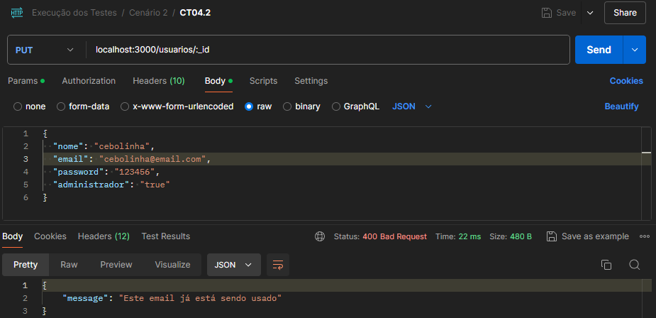

    - CT04.3:

        - Acceptance Criteria: Attempt to register a user with an email from a Gmail or Hotmail provider.

        - Prerequisite: Non-existent user ID.

        - Expected Result: HTTP status 400 indicating that the email provider is not allowed.

        - Result Obtained:

            - Method: PUT

            - URL: http://localhost:3000/users/:_id

            - ID:

            - Body:

                ```
                  Nome: cebolinha
                  Email: cebolinha@gmail.com
                  Senha: 123456
                  Administrador: true
                ```

            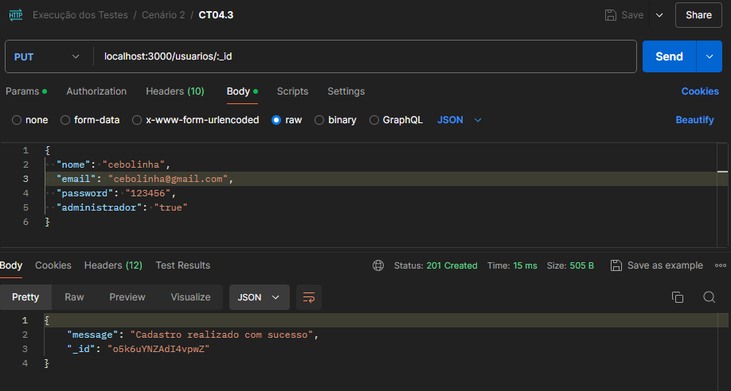

    - CT04.4:

        - Acceptance Criteria: Attempting to register a user with an invalid email address (without @, with invalid special characters, etc.).

        - Prerequisite: Non-existent user ID.

        - Expected Result: HTTP status 400 indicating that the email is invalid.

        - Result Obtained:

            - Method: PUT

            - URL: http://localhost:3000/users/:_id

            - ID:

            - Body:

                ```
                  Nome: cebolinha
                  Email: cebolinhaemail.com
                  Senha: 123456
                  Administrador: true
                ```

            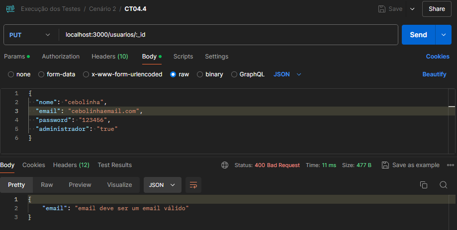

    - CT04.5:

        - Acceptance Criteria: Attempting to register a user with a password outside the limits (less than 5 or greater than 10).

        - Prerequisite: Non-existent user ID.

        - Expected Result: HTTP status 400 indicating that the password does not meet the length requirements.

        - Result Obtained:

            - Method: PUT

            - URL: http://localhost:3000/users/:_id

            - ID:

            - Body:

                ```
                  Nome: cebolinha
                  Email: cebolinha123@email.com
                  Senha: 12345678910
                  Administrador: true
                ```

            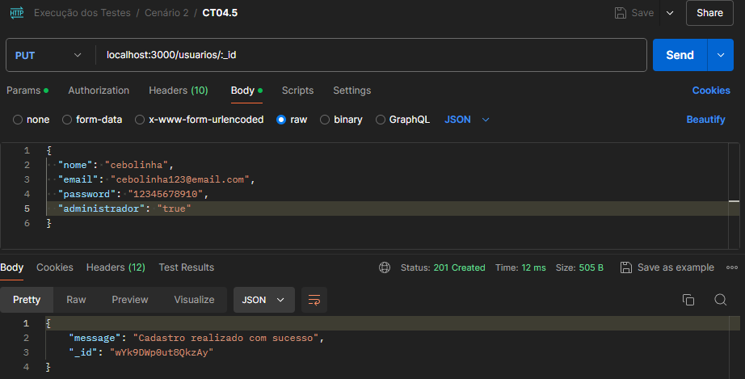

    - CT04.6:

        - Acceptance Criteria: Attempt to register a user without a valid name.

        - Prerequisite: Non-existent user ID.

        - Expected Result: HTTP status 400 indicating that it needs a name.

        - Result Obtained:

            - Method: PUT

            - URL: http://localhost:3000/users/:_id

            - ID:

            - Body:

                ```
                  Nome: " "
                  Email: cebolinha123@email.com
                  Senha: 12345678910
                  Administrador: true
                ```

            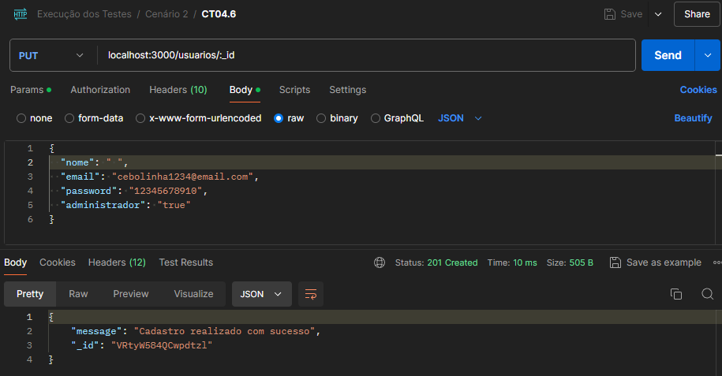

    - CT04.7:

        - Acceptance Criteria: Attempt to register a user without valid fields.

        - Prerequisite: Non-existent user ID.

        - Expected Result: HTTP status 400 indicating that valid fields are required.

        - Result Obtained:

            - Method: PUT

            - URL: http://localhost:3000/users/:_id

            - ID:

            - Body:

                ```
                  Nome: ""
                  Email: ""
                  Senha: ""
                  Administrador: ""
                ```

            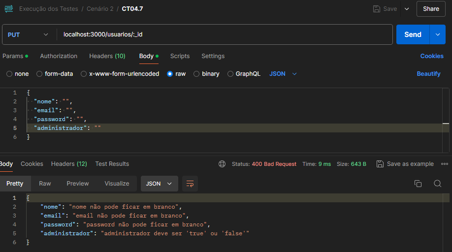

- **CT05** : User update failed

    - CT05.1:

        - Acceptance Criteria: Attempting to update a user with missing required fields.

        - Prerequisite: Existing user.

        - Expected Result: HTTP status 400 indicating that required fields are missing.

        - Result Obtained:

            - Method: PUT

            - URL: http://localhost:3000/users/:_id

            - ID: 2jxUwIiIhFkrdNOe

            - Body:

                ```
                  nome: "",
                  email: "",
                  senha: "",
                  administrador: ""
                ```

            

    - CT05.2:

        - Acceptance Criteria: Update a user with an existing email (on another user).

        - Prerequisite: Existing user, another user with the email to be tested.

        - Expected Result: HTTP status 400 indicating that the email is already in use.

        - Result Obtained:

            - Method: PUT

            - URL: http://localhost:3000/users/:_id

            - ID: 2jxUwIiIhFkrdNOe

            - Body:

                ```
                  nome: "monica",
                  email: "cascao@email.com",
                  senha: "teste",
                  administrador: "true"
                ```

            

    - CT05.3:

        - Acceptance Criteria: Attempting to update a user with an invalid provider email.

        - Prerequisite: Existing user.

        - Expected Result: HTTP status 400 indicating that the email is invalid.

        - Result Obtained:

            - Method: PUT

            - URL: http://localhost:3000/users/:_id

            - ID: 2jxUwIiIhFkrdNOe

            - Body:

                ```
                  nome: "monica",
                  email: "cascao@gmail.com",
                  senha: "teste",
                  administrador: "true"
                ```

            

    - CT05.4:

        - Acceptance Criteria: Attempting to update a user with an out-of-bounds password.

        - Prerequisite: Existing user.

        - Expected Result: HTTP status 400 indicating that the password does not meet the length requirements.

        - Result Obtained:

            - Method: PUT

            - URL: http://localhost:3000/users/:_id

            - ID: 2jxUwIiIhFkrdNOe

            - Body:

                ```
                  nome: "monica",
                  email: "monicaa@email.com",
                  senha: "12345678910",
                  administrador: "true"
                ```

            

    - CT05.5:

        - Acceptance Criteria: Attempt to update a user with the same email that is already registered for another user.

        - Expected Result: HTTP status 400 indicating that the email is already in use and the update cannot be performed.

        - Result Obtained:

            - Method: PUT

            - URL: http://localhost:3000/users/:_id

            - ID: 2jxUwIiIhFkrdNOe

            - Body:

                ```
                  nome: "magali",
                  email: "cascao@email.com",
                  senha: "123456",
                  administrador: "true"
                ```

            

    - CT05.6:

        - Acceptance Criteria: Update an existing user by providing non-standard email.

        - Prerequisite: Existing user.

        - Expected Result: HTTP status 400 indicating invalid email.

        - Result Obtained:

            - Method: PUT

            - URL: http://localhost:3000/users/:_id

            - ID: 0uxuPY0cbmQhpEz1

            - Body:

                ```
                  Nome: "monicao"
                  Email: “monicaemail.com”
                  Senha: "123456"
                  Administrador: “false”
                ```

            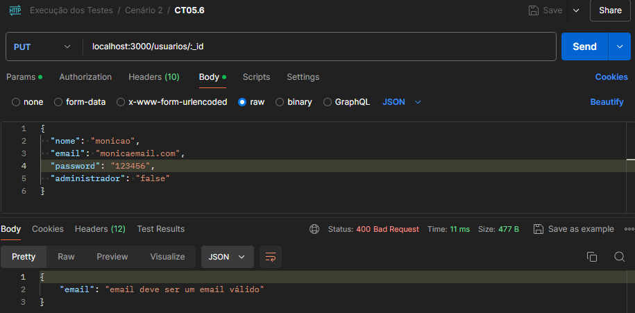

## Scenario 3: User Search

- **CT06** : List of users

    - Acceptance Criteria: Test the listing of all users.

    - Prerequisite: Registered users.

    - Expected Result: HTTP Status 200 (OK), user list returned successfully.

    - Result Obtained:

        - Method: GET
        - URL: http://localhost:3000/users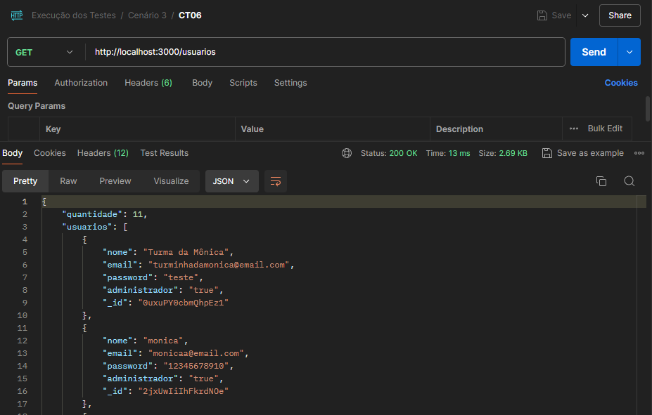

- **CT07** : User search by ID

    - CT07.1:

        - Acceptance Criteria: Test the search for a specific user by valid ID.

        - Prerequisite: Existing user.

        - Expected Result: HTTP Status 200 (OK), user data returned successfully.

        - Result Obtained:

            - Method: GET
            - URL: http://localhost:3000/users/:_id
            - ID: 2jxUwIiIhFkrdNOe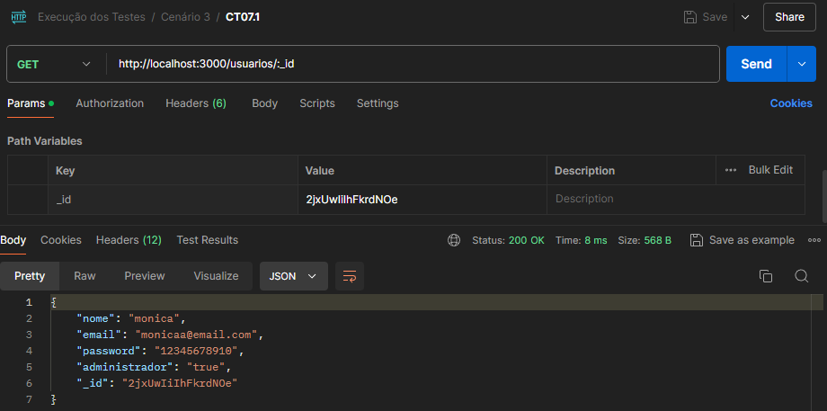

    - CT07.2:

        - Acceptance Criteria: Attempting to perform actions on a user with a non-existent ID.

        - Prerequisite: Non-existent user ID.

        - Expected Result: HTTP status 400 indicating that the user was not found.

        - Result Obtained:

            - Method: GET
            - URL: http://localhost:3000/users/:_id
            - ID: abobrinha123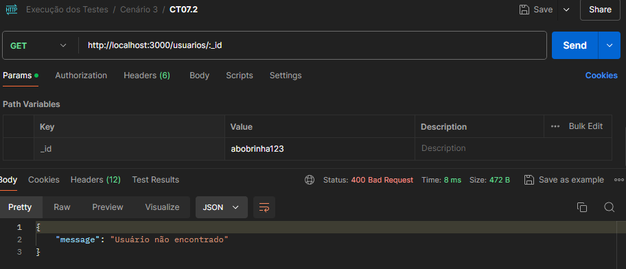

## Scenario 4: User Deletion

- **CT08** : Successful deletion of existing user

    - Acceptance Criteria: Test the deletion of an existing user.

    - Prerequisite: Existing user.

    - Expected Result: HTTP Status 200 (OK), user deleted successfully.

    - Result Obtained:

        - Method: DELETE
        - URL: http://localhost:3000/users/:_id
        - ID: 4ypdQr2AmmLJEgU0

- **CT09** : Deletion of non-existent user

    - Acceptance Criteria: Attempting to perform actions on a user with a non-existent ID.

    - Prerequisite: Non-existent user ID.

    - Expected Result: HTTP Status 200

    - Result Obtained:

        - Method: DELETE
        - URL: http://localhost:3000/users/:_id
        - ID: abobrinha123

- **CT010** : Deleting a user with a cart

    - Acceptance Criteria: Attempt to perform actions on a user with an existing ID and cart.

    - Prerequisite: Existing user ID and registered cart.

    - Expected Result: HTTP status 400 indicating user has cart.

    - Result Obtained:

        - Method: DELETE
        - URL: http://localhost:3000/users/:_id
        - ID: 0uxuPY0cbmQhpEz1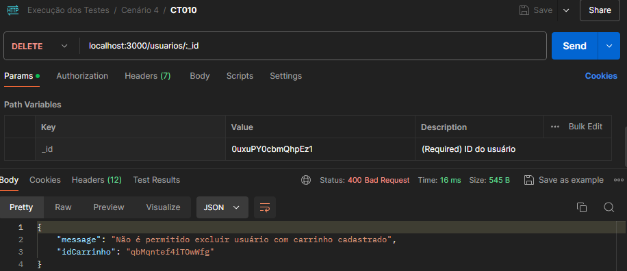