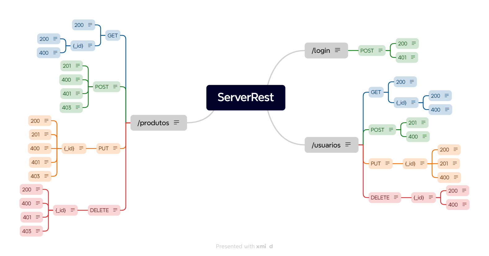

# Sprint 3

* Planejamento e análise de testes;
* Planejamento de testes de APIs REST;
* Definition of Done, Definition of Ready & Acceptance Criteria;
* Gestão de Issues;
* Gestão de Testes;
* Execução e criação de testes: avançando no Postman.

## Challenge Sprint 3 - Plano de Teste do ServeRest:

### Resumo:

O plano de teste da aplicação ServeRest abrange a validação da funcionalidade de login, gerenciamento de produtos e cadastro de vendedores da API do Marketplace ServeRest, garantindo que seja possível cadastrar e editar perfis dos vendedores, uma autenticação segura dos vendedores e o acesso e operações de gerenciamento de produtos.

### Estratégia:

- Análise dos Critérios e Criação de Casos de Teste: Uma lista de casos de teste que abrangem todos os critérios de aceitação e cenários além do Swagger.
- Preparação do Ambiente de Testes: Configurar o Postman, o banco de dados de testes e usar o Swagger.
- Execução dos Testes: Executar cada caso de teste no Postman, verificar as respostas da API e documentar resultados no Jira.
- Análise dos Resultados e Relatório: Analisar os resultados dos testes e sugerir melhorias

### Análise da API pelas Rotas (/usuarios, /login, /produtos):

**Rotas de Usuários:**

* Cenário 1: Cadastro de Usuário (Vendedor)
    - CT01: Cadastro de usuário com sucesso
    - CT02: Cadastro de usuário com falha  
* Cenário 2: Atualização de Usuário
    - CT03: Atualização de usuário existente com sucesso
    - CT04: Atualização de usuário inexistente (criação de novo usuário)
    - CT05: Atualização de usuário com falha
* Cenário 3: Busca de Usuários
    - CT06: Listagem dos usuários
    - CT07: Busca de usuário por ID
* Cenário 4: Exclusão de Usuário
    - CT08: Exclusão de usuário existente com sucesso
    - CT09: Exclusão de usuário inexistente
    - CT010: Exclusão de usuário existente com carrinho

**Rotas de Login:**

* Cenário: Autenticação de Usuário
    - CT01: Login com email e senha válidos
    - CT02: Login com email válido e senha em branco
    - CT03: Login com email válido e senha incorreta
    - CT04: Login com email em branco e senha válida
    - CT05: Login com email e senha em branco
    - CT06: Login com email em formato inválido e senha válida
    - CT07: Login com email válido e senha com menos de 5 caracteres
    - CT08: Login com email válido e senha com mais de 10 caracteres
    - CT09: Login com email de usuário não cadastrado

**Rotas de Produtos:**

* Cenário 1: Cadastrar Produto
    - CT01: Criar produto com sucesso (autenticado)
    - CT02: Criar produto com nome duplicado (autenticado)
    - CT03: Criar produto sem autenticação
    - CT04: Criar produto com dados inválidos (autenticado)
    - CT05: Criar produto não sendo administrador
* Cenário 2: Atualizar Produto
    - CT06: Atualizar produto existente com sucesso (autenticado)
    - CT07: Atualizar produto inexistente (autenticado)
    - CT08: Atualizar produto com nome duplicado (autenticado)
    - CT09: Atualizar produto sem autenticação
    - CT10: Atualizar produto com dados inválidos (autenticado)
    - CT11: Atualizar produto não sendo administrador
* Cenário 3: Listar Produtos (GET /produtos)
    - CT12: Listar todos os produtos
    - CT13: Listar produtos com ID válido
    - CT14: Listar produtos com ID inválido
* Cenário 4: Deletar Produto (DELETE /produtos/{id})
    - CT15: Deletar produto existente com sucesso (autenticado)
    - CT16: Deletar produto inexistente (autenticado)
    - CT17: Deletar produto em carrinho (autenticado)
    - CT18: Deletar produto sem autenticação
    - CT19: Deletar produto não sendo adminstrador

**Testes Candidatos à Automação:**

Considerando custo-benefício, eficiência e cobertura de testes, a automação desses testes trará vantagens significativas em relação aos testes manuais:

- Teste de fluxo principal: Deve ser testado com frequência para garantir que essas funcionalidades básicas estejam funcionando corretamente a cada nova versão da API. Como CT01 (Login), CT01 (Produtos), CT01 (Usuários) e outros.
- Testes repetitivos: Casos que envolvem testar diversas combinações de dados inválidos. A automação permite executar esses testes de forma rápida e precisa, garantindo que todas as validações sejam testadas e que as regras de negócio sejam aplicadas corretamente. Como o CT02 e CT05 (Usuários) que envolvem testar diversas combinações de dados inválidos.
- Testes com grande volume de dados: Os que podem envolver um grande volume de dados, tornando a verificação manual trabalhosa e demorada. Como CT06 (Usuários) e CT12 (Produtos).

**Ferramentas:**

- Postman: Para testes manuais exploratórios e criação de coleções de testes.
- Swagger: Para gerar documentação como base para casos de teste iniciais.
- Xmind: Para a criação de mapas mentais para análise
- Jira: Para organização do planejamento de testes.

### [Mapa Mental](MapaMental_ServerRest.xmind)
<figure>
  
</figure>

#### Resumo dos Dias:

##### Dia 1 e 2: MasterClass
- Planning Sprint 3
- Refinando conhecimentos de análise e planejamento de testes
- Curso Udemy: Início rápido em testes de software

##### Dia 3: MasterClass
- DoR
- DoD
- Acceptance Criteria
- Dinâmica

##### Dia 4: MasterClass
- Gestão de Issues
- Dinâmica

##### Dia 5 e 6: MasterClass
- Risco e Impacto
- Ciclo de Teste
- Atividade: Uso/Migração do Jira + Test Cycles

##### Dia 7, 8 e 9: Evolução Challenge
- Exercíos Challenge
- Mentoria