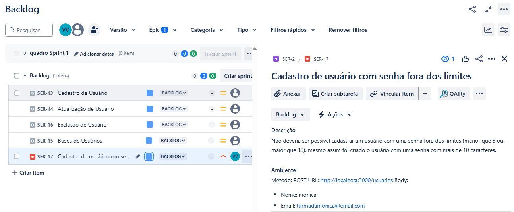
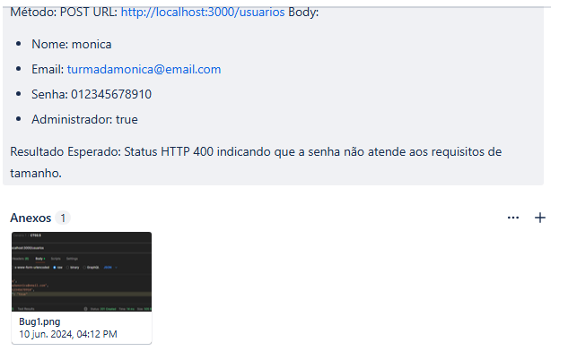
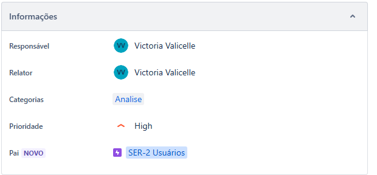

# Dia 4: MasterClass

- Gestão de Issues
- Dinâmica

## Gestão de Issues

### Report de Teste

#### Status de execução de um caso de teste

- Aberto: ainda não foi executado.
- Em execução: está sendo executado.
- Passou: Foi executado e não possui bugs vinculados ao fluxo.
- Falhou: Foi executado e possui bug no fluxo.
- Bloqueado: Alguma ação externa bloqueou o fluxo.
- Cancelado: Não será executado.

#### **Tipos de Jira: Bug ou Issue de aceitação**

Durante a etapa de aceite o cliente vai abrir as solicitações do tipo bug criadas durante a homologação do sistema para a verificação. Pode ser ativada no jira solicitações do cliente o tipo issue de aceitação, assim fica mais fácil a rastreabilidade do que foi aberto pela equipe interna ou cliente.

#### **Como identificar uma solicitação do cliente:**

O problema encontrado é um bug ou uma melhoria?

A melhoria surge para proporcionar algum benefício no software e passa pela gestão do projeto para verificação, enquanto o erro impactará na obtenção do resultado esperado, não funciona como definido pelo cliente.

#### **Como classificar bug em dev/análise/massa/ambiente**

**DEV:** Ocorre devido a uma falha no desenvolvimento.

**ANÁLISE:** Especificações funcionais e técnicas elaboradas erroneamente ou que não suprem a necessidade do cliente.

**MASSA:** Inconsistência nos dados utilizados para testes.

**AMBIENTE:** Falha no ambiente que está sendo utilizado para testes.

#### Como criar issues?

1. Projeto: Nome do projeto.

2. Tipo: A natureza da issue (bug, melhoria, tarefa, etc).

3. Resumo: Descreve a issue de forma concisa.

4. Descrição e Passos: Detalha o problema ou tarefa, junto com contexto, passos para reprodução, comportamento esperado e o obtido, impacto e requisitos.

5. Relator: Quem está reportando a issue.

6. Prioridade: A urgência da issue (baixa, média, alta ou crítica).

7. Categoria: Classificar a issue em grupos (como interface, backend, etc) para facilitar a organização e filtragem. 

## Dinâmica

1. Crie um bug baseado em testes exploratórios da API ServeRest;
2. Priorize o bug que foi criado;
3. Faça o vínculo do bug no Epic e Story correspondentes;
4. Faça a classificação da causa do bug em dev/análise/massa/ambiente.

<figure>
  
</figure>
<figure>
  
</figure>
<figure>
  
</figure>