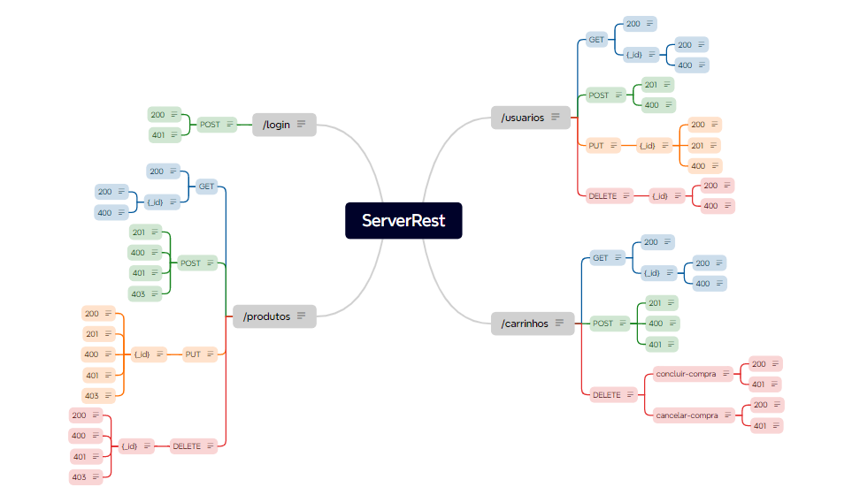

## Plano de Teste ServeRest:

### Resumo:

O plano de teste da aplicação ServeRest abrange a validação da funcionalidade de login, gerenciamento de produtos, cadastro de vendedores e gerenciamento de carrinho da API do Marketplace ServeRest, garantindo que seja possível cadastrar e autenticar perfis dos vendedores, ter acesso a operações de gerenciamento de produtos e carrinhos.

### Estratégia:

- Análise dos Critérios e Criação de Casos de Teste: Uma lista de casos de teste que abrangem todos os critérios de aceitação e cenários além do Swagger.
- Preparação do Ambiente de Testes: Configurar o Postman, o banco de dados de testes e usar o Swagger.
- Execução dos Testes: Executar cada caso de teste no Postman, verificar as respostas da API e documentar resultados no Jira.
- Análise dos Resultados e Relatório: Analisar os resultados dos testes e sugerir melhorias

### Análise da API pelas Rotas (/usuarios, /login, /produtos, /carrinhos):

**Rotas de Usuários:**

- Cenário 1: Cadastro de Usuário (Vendedor)
    - CT01: Cadastro de usuário com sucesso
    - CT02: Cadastro de usuário com falha
- Cenário 2: Atualização de Usuário
    - CT03: Atualização de usuário existente com sucesso
    - CT04: Atualização de usuário inexistente (criação de novo usuário)
    - CT05: Atualização de usuário com falha
- Cenário 3: Busca de Usuários
    - CT06: Listagem dos usuários
    - CT07: Busca de usuário por ID
- Cenário 4: Exclusão de Usuário
    - CT08: Exclusão de usuário existente com sucesso
    - CT09: Exclusão de usuário inexistente
    - CT010: Exclusão de usuário existente com carrinho

**Rotas de Login:**

- Cenário: Autenticação de Usuário
    - CT01: Login com email e senha válidos
    - CT02: Login com email válido e senha em branco
    - CT03: Login com email válido e senha incorreta
    - CT04: Login com email em branco e senha válida
    - CT05: Login com email e senha em branco
    - CT06: Login com email em formato inválido e senha válida
    - CT07: Login com email válido e senha com menos de 5 caracteres
    - CT08: Login com email válido e senha com mais de 10 caracteres
    - CT09: Login com email de usuário não cadastrado

**Rotas de Produtos:**

- Cenário 1: Cadastrar Produto
    - CT01: Criar produto com sucesso (autenticado)
    - CT02: Criar produto com nome duplicado (autenticado)
    - CT03: Criar produto sem autenticação
    - CT04: Criar produto com dados inválidos (autenticado)
    - CT05: Criar produto não sendo administrador
- Cenário 2: Atualizar Produto
    - CT06: Atualizar produto existente com sucesso (autenticado)
    - CT07: Atualizar produto inexistente (autenticado)
    - CT08: Atualizar produto com nome duplicado (autenticado)
    - CT09: Atualizar produto sem autenticação
    - CT10: Atualizar produto com dados inválidos (autenticado)
    - CT11: Atualizar produto não sendo administrador
- Cenário 3: Listar Produtos
    - CT12: Listar todos os produtos
    - CT13: Listar produtos com ID válido
    - CT14: Listar produtos com ID inválido
- Cenário 4: Deletar Produto
    - CT15: Deletar produto existente com sucesso (autenticado)
    - CT16: Deletar produto inexistente (autenticado)
    - CT17: Deletar produto em carrinho (autenticado)
    - CT18: Deletar produto sem autenticação
    - CT19: Deletar produto não sendo adminstrador

**Rotas de Carrinhos:**

- Cenário 1: Cadastro de Carrinho
    - CT01: Cadastro de carrinho com usuário autenticado
    - CT02: Cadastro de carrinho com usuário não autenticado
    - CT03: Cadastro de um segundo carrinho com o mesmo usuário
    - CT04: Cadastro de produto inexistente
    - CT05: Cadastro de produto em quantidade fora do estoque
    - CT06: Cadastro de produto duplicado
    - CT07: Cadastro de produto com dados incompletos (sem ID do produto)
- Cenário 2: Listagem de Carrinho
    - CT08: Listagem de carrinhos
    - CT09: Listagem do usuário com carrinho vazio
    - CT10: Listagem de carrinho por id
- Cenário 3: Exclusão de Carrinho
    - CT11: Exclusão de carrinho ao cancelar compra com sucesso
    - CT12: Exclusão de carrinho sem token válido (cancela-compra)
    - CT13: Exclusão de carrinho inexistente (cancela-compra)
    - CT14: Exclusão de carrinho ao concluir compra com sucesso
    - CT15: Exclusão de carrinho inexistente (concluir-compra)
    - CT16: Exclusão de carrinho sem token válido (concluir-compra)

**Testes Candidatos à Automação:**

Considerando custo-benefício, eficiência e cobertura de testes, a automação desses testes trará vantagens significativas em relação aos testes manuais:

- Teste de fluxo principal: Deve ser testado com frequência para garantir que essas funcionalidades básicas estejam funcionando corretamente a cada nova versão da API. Como CT01 (Login), CT01 (Produtos), CT01 (Usuários), CT01 (Carrinhos), entre outros.
- Testes repetitivos: Casos que envolvem testar diversas combinações de dados inválidos. A automação permite executar esses testes de forma rápida e precisa, garantindo que todas as validações sejam testadas e que as regras de negócio sejam aplicadas corretamente. Como o CT02 e CT05 (Usuários) que envolvem testar diversas combinações de dados inválidos.
- Testes com grande volume de dados: Os que podem envolver um grande volume de dados, tornando a verificação manual trabalhosa e demorada. Como CT06 (Usuários), CT08 (Carrinhos) e CT12 (Produtos).

**Ferramentas:**

- Postman: Para testes manuais exploratórios e criação de coleções de testes.
- Swagger: Para gerar documentação como base para casos de teste iniciais.
- Xmind: Para a criação de mapas mentais para análise
- Jira: Para organização do planejamento de testes.

## [Mapa Mental](ServerRest.xmind) e [Jira](https://victoriavalicelle.atlassian.net/jira/software/projects/SCRUM/boards/1)

