# Performance Test Plan

## Individual Test Scenarios

**Method** | **Test** | **Options** | **Thresholds**
--- | --- | --- | ---
**GET (POST - Login)** | **Spike Test** | `stages: [{ duration: '10s', target: 50 }, { duration: '3s', target: 500 } { duration: '10s', target: 50 }],` | `'http_req_duration': ['max < 500'], 'http_req_failed': ['rate<0.01'],`
**GET with ID (POST - Login)** | **Stress Test** | `stages: [{ duration: '1m', target: 100 }, { duration: '1m', target: 500 }, { duration: '1m', target: 700 }, { duration: '1m', target: 1000 }, { duration: '5m', target: 0 }],` | `'http_req_duration': ['max < 500'], 'http_req_failed': ['rate<0.05'],`
**POST** | **Soak Test** | ` stages: [{{ duration: '3m', target: 500 }, { duration: '10m', target: 500 }, { duration: '3m', target: 0 },` | `'http_req_duration': ['p(95)<300'], 'http_req_failed': ['rate<0.01'],`
**PUT (POST - Login)** | **Load Test** | `stages: [{ duration: '1m', target: 200 }, { duration: '1m', target: 200 }, { duration: '2m', target: 0 }],` | `'http_req_duration': ['p(95)<300'], 'http_reqs': ['rate>100'], 'http_req_failed': ['rate<0.01'],`
**DELETE (POST - Login)** | **Smoke Test** | `vus: 1, duration: '1s',` | `'http_req_failed': ['rate=0'], 'http_req_duration': ['p(100)<1000'],`

## Test Scenarios Flow

1. Create a user, log in with the user and create a product.
2. List user, login with user, list product, delete product.

# Results

## **Spike Test:**

- LOGIN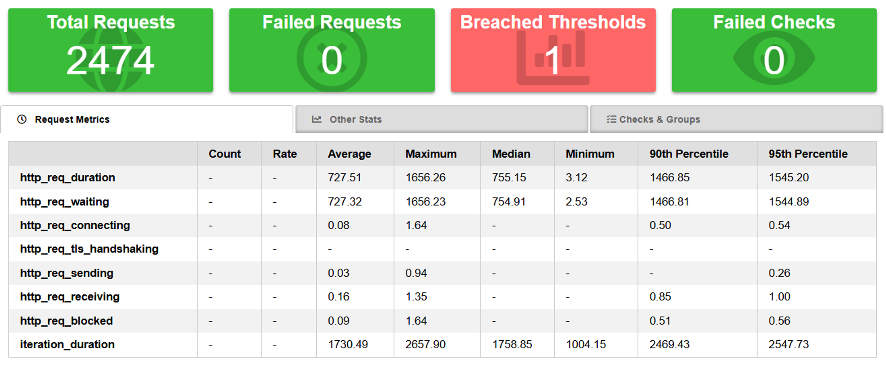

- PRODUCTS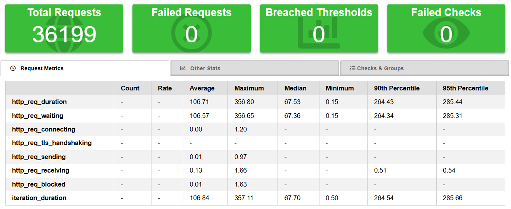

- USERS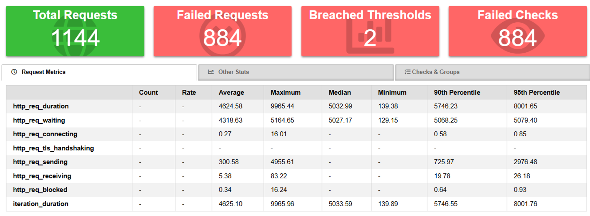

## **Stress Test:**

- LOGIN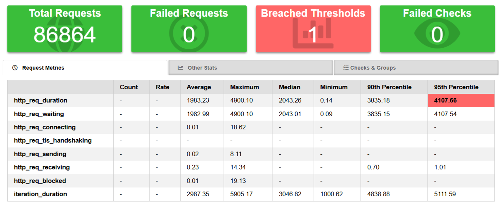

- PRODUCTS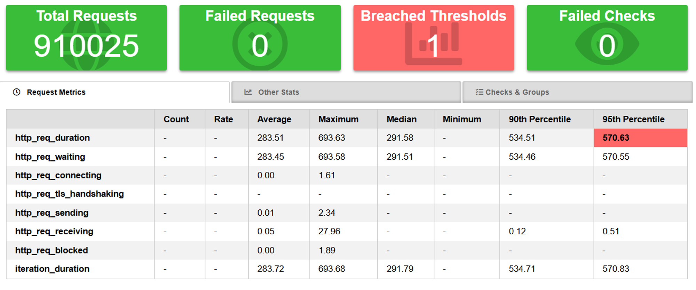

- USERS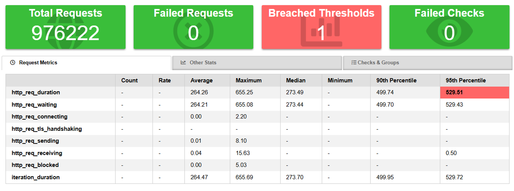

## **Load Test:**

- LOGIN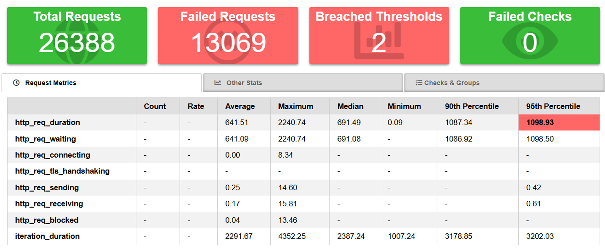

- PRODUCT

- USER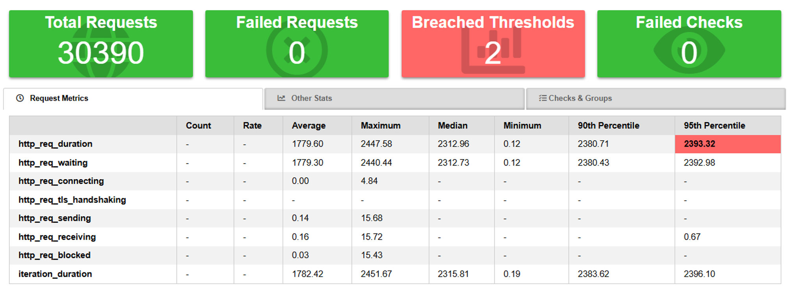

## **Smoke Test:**

- LOGIN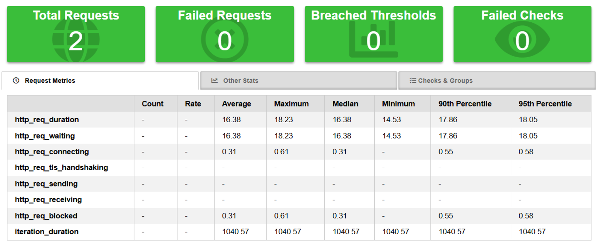

- PRODUCT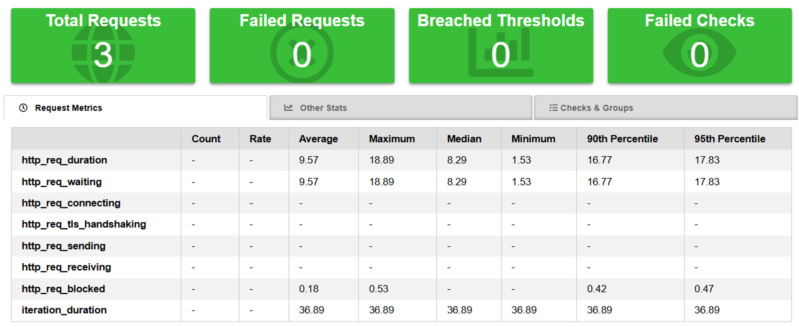

- USER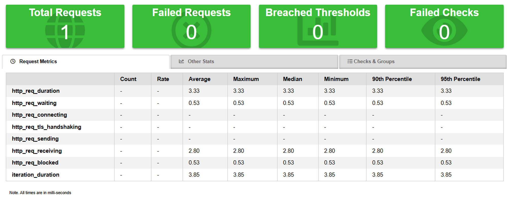

## **Soak Test:**

- LOGIN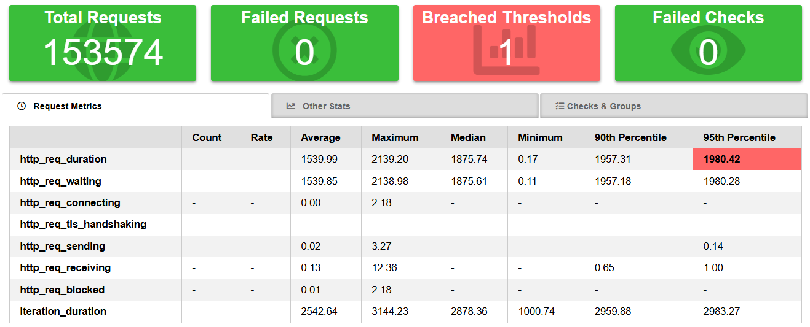

- PRODUCTS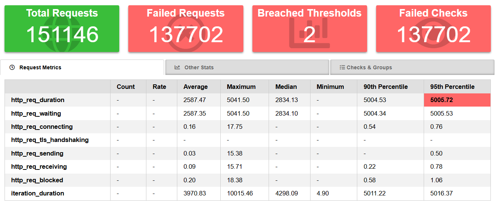

- USERS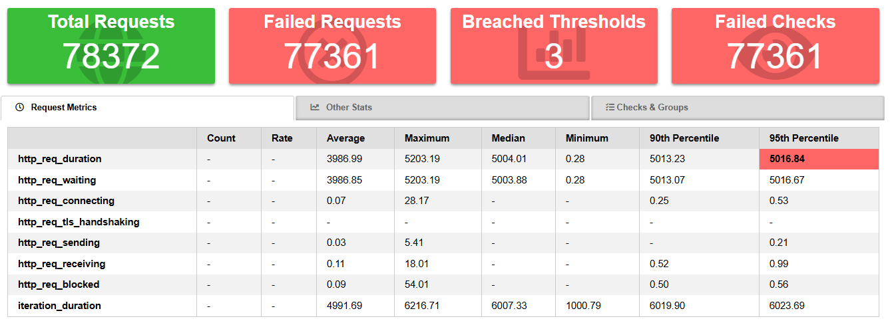

## **Flows:**

1.

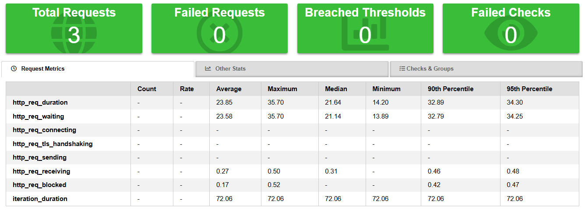

1.

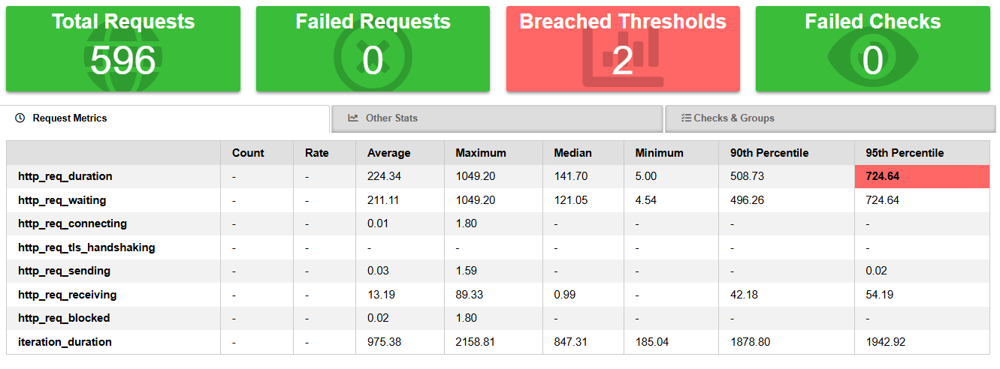